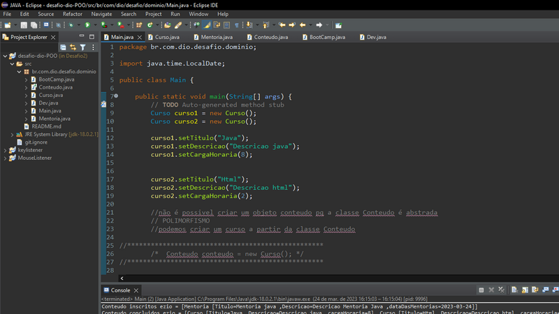

# Desafio POO bootcamp Dio

> Descricao:

O objetivo foi aprender na prática técnicas de herança, polimorfismo, encapsulamento etc..
Apliquei técnicas aprendidas no bootcamp com a Profissional Camila.

## Tecnologias

- POO
- JAVA

## Contato
- E-mail: ezim10g@gmail.com
- Linkedin: https://www.linkedin.com/in/eziovieira/
